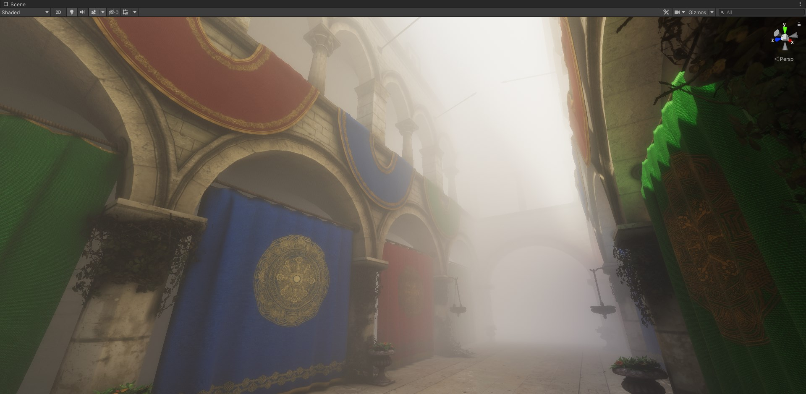
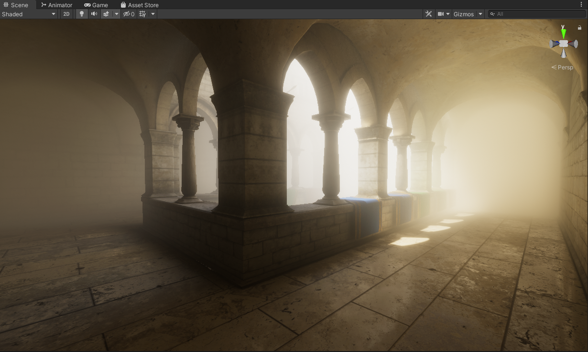
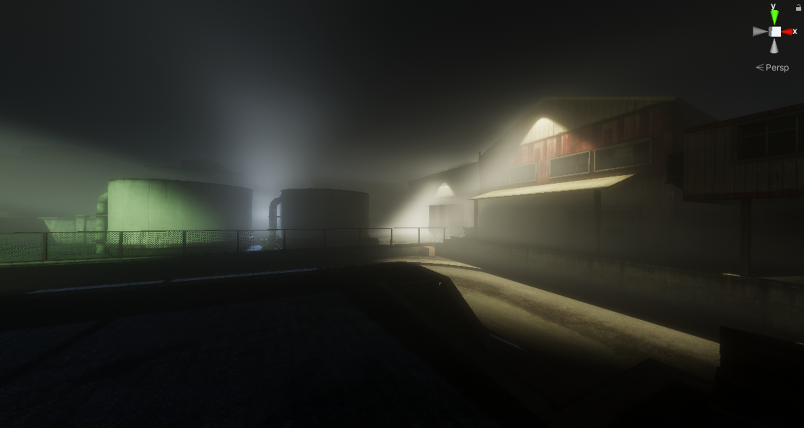
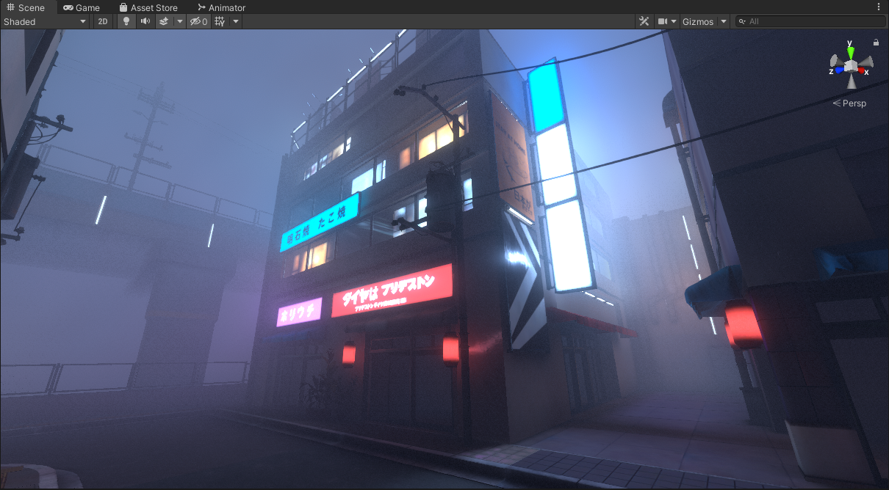
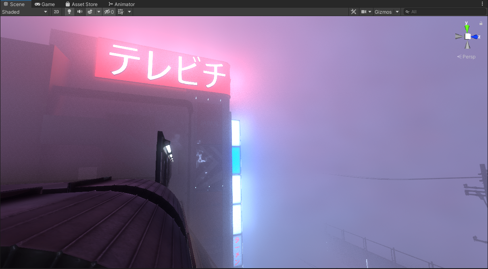
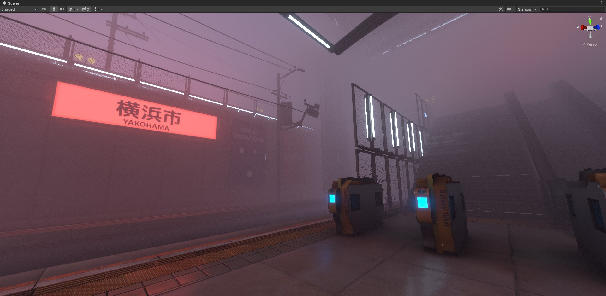
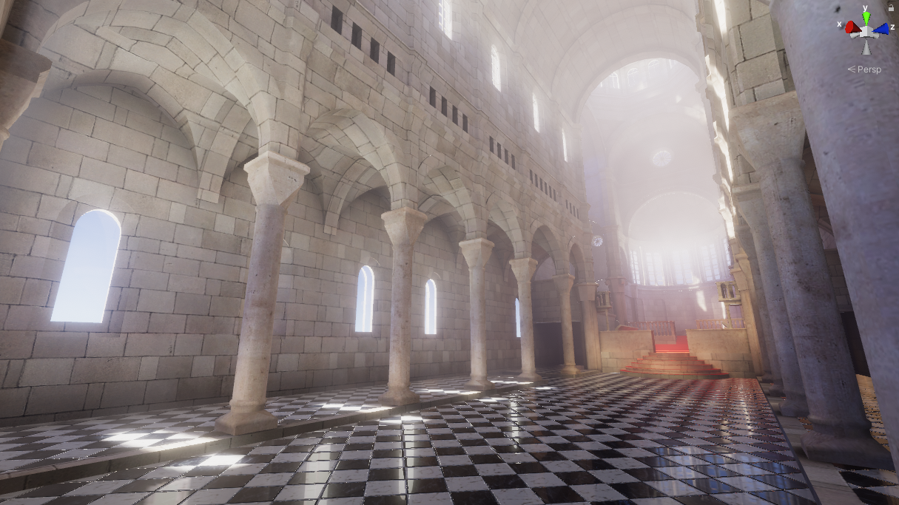
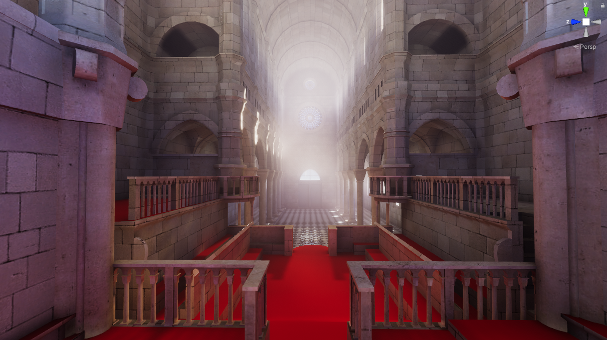

# Unity Baked Volumetrics
A **work in progress** graphics solution for completely baked volumetric lighting, meant to be very lightweight and inexpensive for VR *(and non-vr)*. 

***More details will be revealed but it's very much a work in progress...***

# Results

# Features

Overview: This is basically lightmapping but for volumetric fog. 

- Completely baked volumetric lighting designed to be lightweight and fast at runtime, and it's baked completely offline in-editor.
- Volumetric lighting can be generated from multiple sources. (Light Probes, CPU raytacer, *Experimental:* Voxelized GPU raytracer, *Experimental:* IBL) 
- Density is baked into the 3d texture (RGB: Color A: Density) and different density types can be used for different looks. (Constant, Luminance Based, Height Based, Luminance Height Based).
- Post Adjustments can be applied to tweak and improve the look of the generated volume (Brightness, Contrast, Saturation, Vibrance, Hue Shift, Gamma, Color Filter, Color Multiplication, and seperable Gaussian Blur).
- Multiple versions of the same effect to suit different needs... (A scene based version, and multiple post process versions)

**NOTE: Constructed on the Built-In Rendering Pipeline.**

# Information

## How it works

To start you define a box volume within your scene, setting where its located, and it's bounds. You then resolution of the 3D texture by determining the size of the indivudal voxels, or you can set a custom resolution by hand. Next you can choose to either sample lighting from the scene light probes, or a custom raytracer, or both *(each have their advantages and drawbacks)*. After that there is an option to set the fog density of the volume *(constant, luminance, height based, etc.)* The next step is to generate a 3D texture that is saved into the disk. 

For the shader, what we do is sample that 3D texture and perform a raymarch through it, checking it against the scene depth buffer. The ray terminates if: it intersects with the scene, is out of bounds, or if the density is too thick. The result is then lerped with the scene color buffer based on transmittance.

## Multiple Implementations

There are 2 versions of this effect, two being a typical **Post Process** versions, and the other is a **Scene Based solution** solution...

### Post Processing V1
This is the first implementation of the effect implemented as a post process. It does exactly as described in the **How it works** section.

### Post Processing V2
This is similar to **Post Processing V2**, but an optimization was added to where the volumetrics are rendered at half resolution and upsampled.

### Scene Based
First implementation of the effect implemented as a scene based effect. This is for circumstances where you can't create custom post processing effects. Why the heck would this be the case? A good example of this scenario is VRChat where you can't make custom post processing effects, but you can still make shaders within the scene itself. 

This REQUIRES camera depth generation enabled. This works automatically for deferred rendering, but not for forward rendering by default. You can enable it by using C# scripting. However if you don't have access to the main camera properties there are other ways of enabling it.

***Camera Depth Texture Trick 1:*** If the post processing stack is avaliable, you can enable ambient occlusion which will enable the camera depth texture generation flag. For a low overhead put the AO quality settings at its lowest if you don't intend to use it. *(The intensity value also needs to be greater than 0 otherwise the effect won't be active)*

***Camera Depth Texture Trick 2:***  Courtesy of [orels1](https://github.com/orels1), Create a directional light, that casts shadows. Set the culling layer on that directional light to hit a specific layer which will cause unity to enable camera depth texture generation.

*Will be elaborated on but yes this has been tested and works on Oculus/Meta Quest 2.*

## Advantages/Drawbacks

### Advantages

- Fast, because at runtime a 3D texture is sampled and raymarched against the scene depth buffer. No additional (sampling of lights and shadowmaps, etc.) are performed.
- The look of the volumetrics are generated purely offline. With the nature of it being offline you can apply alot more computation and processing to sample things like indirect lighting which completely transforms the look of the fog.

### Drawbacks

- High resolution 3D textures can eat up VRAM and disk space easily, so to keep it small they have to be low resolution which isn't good for crisp shadows.
- This implementation is completely baked, meaning any runtime lights will not change or affect the look of the fog.
- If you are sampling from light probes only, the clarity/precision/resolution of your volume depends on how densely populated your light probe grid is. If it's very sparse then your volume will look very low resolution (even if you are using a high resolution 3D texture) because there is not enough light probes to sample from.
- For the Post Processing V1/V2 implementations you cannot stack multiple volumes. (This should be solved in the future with a newer implementation that utilizes a froxel)
- Sampling from the CPU raytracer is very slow, it's a basic implementation and it requires colliders in order to work properly.
- For Post Processing V1/V2 and Scene Based implementations, low raymarch samples (or high raymarch distances) can lead to very noisy results.

## Future Plans/Ideas

- **GENERAL:** Add option for animated noise.
- **GENERAL:** Look for ways to interpolate between samples to reduce noise.
- **POST PROCESSING:** Use interleaved rendering.
- **POST PROCESSING:** Use temporal filtering in-conjunction with animated noise to accumulate samples over multiple frames.
- **POST PROCESSING:** Using a froxel solution to intersect multiple volumes in a scene, so we can raymarch only once rather than raymarch for each volume in the scene which would be dumb. This also allows the abillity to have multiple volumes in the scene in an efficent way for the post processing solution.
- **OFFLINE VOLUME GENERATION:** Improve the cpu raytraced volume speed by multithreading.
- **OFFLINE VOLUME GENERATION:** Create a custom pathtraced/raytraced solution that voxelizes the scene within the volume and traces against it rather than relying on scene light probes which can be low quality and dependent on user placement (Could also be potentially faster than the current CPU only implemntation of the raytracer?).
- **OFFLINE VOLUME GENERATION:** Save the raw sample results, so that if the user wishes to apply post adjustments they can do so without needing to resample the scene again which can take a long time.
- **EDITOR:** Previewing Voxels is really really slow at low density values, need to come up with a different way to preview the different voxels.
- **EDITOR:** Add a context menu item in the scene hiearchy to create a volume.
